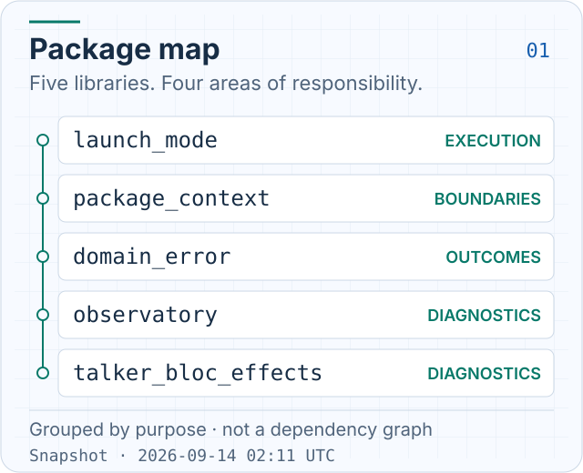
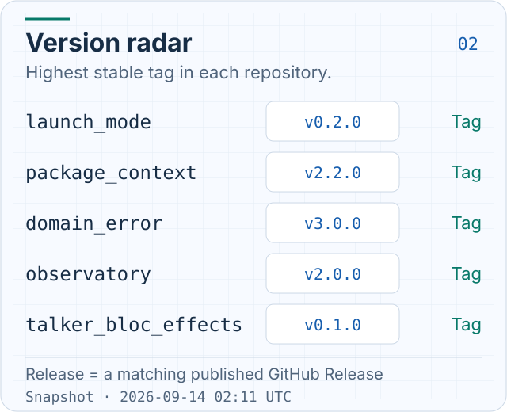
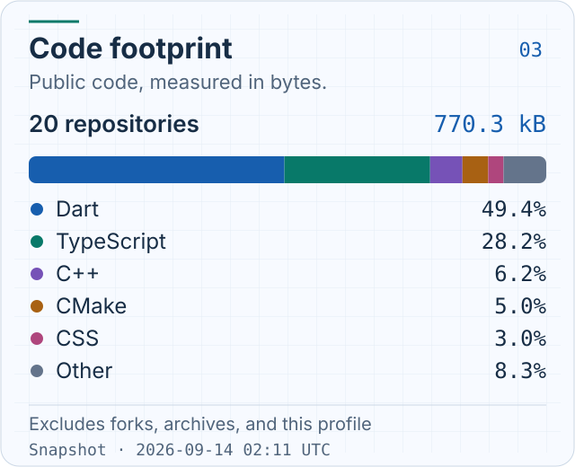

# Andrey Krasheninnikov

**Mobile & Backend Engineer · Flutter / Dart / Go**

I build mobile applications and backend services with clear contracts, predictable
async behavior, and useful diagnostics. I care about changes that are easy to
review, test, and ship.

### How I work

- **Architecture:** explicit ownership, small interfaces, and clear module boundaries.
- **Reliability:** typed errors, deliberate state transitions, and safe retries.
- **Diagnostics:** useful logs, observable failures, and enough context to find the cause.
- **Delivery:** focused reviews, meaningful tests, and verified releases.

### Open source

Small tools for the parts of an application that need to stay predictable.

<picture>
  <source media="(prefers-color-scheme: dark)" srcset="assets/widgets/package-map-dark.svg">
  <source media="(prefers-color-scheme: light)" srcset="assets/widgets/package-map-light.svg">
  
</picture>

| Project | What it does |
| :--- | :--- |
| [observatory](https://github.com/pchkauu/observatory) | Isolate-aware Flutter logs, bounded history, safe HTTP logging, and Sentry incident capture. |
| [domain_error](https://github.com/pchkauu/domain_error) | Typed domain errors, Result/Either, and synchronous or asynchronous error capture. |
| [package_context](https://github.com/pchkauu/package_context) | Typed configuration and host dependencies with explicit package boundaries. |
| [launch_mode](https://github.com/pchkauu/launch_mode) | Foreground and background execution context for Flutter entry points and handlers. |
| [talker_bloc_effects](https://github.com/pchkauu/talker_bloc_effects) | One Talker observer for BLoC events, states, errors, and effects. |

### Version radar

The highest stable tag in each library. `Release` means that tag also has a
published, non-prerelease GitHub Release; otherwise it is marked `Tag`.

<picture>
  <source media="(prefers-color-scheme: dark)" srcset="assets/widgets/version-radar-dark.svg">
  <source media="(prefers-color-scheme: light)" srcset="assets/widgets/version-radar-light.svg">
  
</picture>

### Code footprint

Language distribution by bytes of code in my public repositories, excluding
forks, archives, and this profile repository. The five largest languages appear
individually; the rest are grouped as `Other`. This describes the public code,
not time spent or proficiency.

<picture>
  <source media="(prefers-color-scheme: dark)" srcset="assets/widgets/code-footprint-dark.svg">
  <source media="(prefers-color-scheme: light)" srcset="assets/widgets/code-footprint-light.svg">
  
</picture>

[Explore all public repositories](https://github.com/pchkauu?tab=repositories)

Each card shows its snapshot time. <a href="docs/widgets.md">Widget maintenance</a>.
