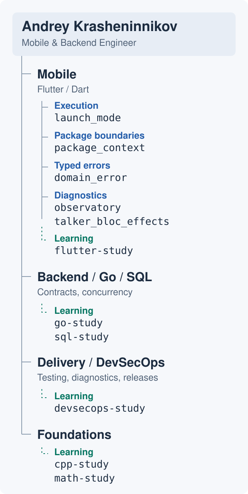

# Andrey Krasheninnikov

**Mobile & Backend Engineer · Flutter / Dart / Go**

I build mobile applications and backend services with clear contracts, predictable
async behavior, and useful diagnostics. I care about changes that are easy to
review, test, and ship.

### How I work

- **Architecture:** explicit ownership, small interfaces, and clear module boundaries.
- **Reliability:** typed errors, deliberate state transitions, and safe retries.
- **Diagnostics:** useful logs, observable failures, and enough context to find the cause.
- **Delivery:** focused reviews, meaningful tests, and verified releases.

<picture>
  <source media="(prefers-color-scheme: dark)" srcset="assets/mind-map-dark.svg">
  <source media="(prefers-color-scheme: light)" srcset="assets/mind-map-light.svg">
  
</picture>

### Open source

Small tools for the parts of an application that need to stay predictable.

| Project | What it does |
| :--- | :--- |
| [observatory](https://github.com/pchkauu/observatory) | Isolate-aware Flutter logs, bounded history, safe HTTP logging, and Sentry incident capture. |
| [domain_error](https://github.com/pchkauu/domain_error) | Typed domain errors, Result/Either, and synchronous or asynchronous error capture. |
| [package_context](https://github.com/pchkauu/package_context) | Typed configuration and host dependencies with explicit package boundaries. |
| [launch_mode](https://github.com/pchkauu/launch_mode) | Foreground and background execution context for Flutter entry points and handlers. |
| [talker_bloc_effects](https://github.com/pchkauu/talker_bloc_effects) | One Talker observer for BLoC events, states, errors, and effects. |

### Learning in public

I study these subjects to build more reliable software and understand how it runs.

- **[flutter-study](https://github.com/pchkauu/flutter-study):** To build reliable mobile apps and make informed decisions about state, rendering, and platform integration.
- **[go-study](https://github.com/pchkauu/go-study):** To design backend services with clear contracts, predictable concurrency, and useful diagnostics.
- **[sql-study](https://github.com/pchkauu/sql-study):** To model data, understand query performance, and reason about consistency in relational databases.
- **[cpp-study](https://github.com/pchkauu/cpp-study):** To understand memory, compilation, and how programs interact with operating systems and hardware.
- **[devsecops-study](https://github.com/pchkauu/devsecops-study):** To connect development with infrastructure, security, and repeatable delivery.
- **[math-study](https://github.com/pchkauu/math-study):** To strengthen the reasoning behind algorithms, complexity, and engineering trade-offs.

[Explore all public repositories](https://github.com/pchkauu?tab=repositories)
