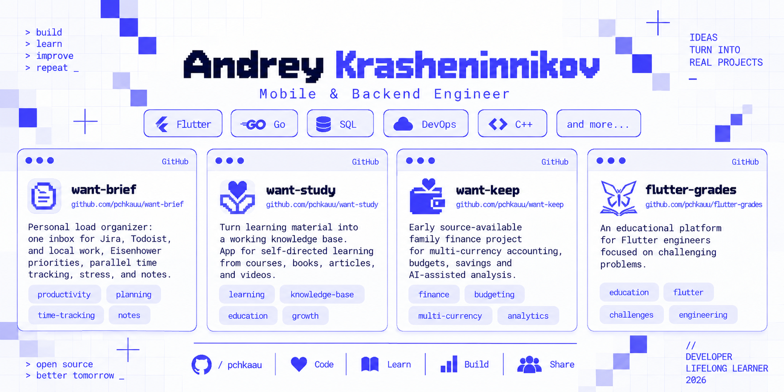

<picture>
  <source media="(prefers-color-scheme: dark)" srcset="assets/cover-dark.png">
  <source media="(prefers-color-scheme: light)" srcset="assets/cover-light.png">
  
</picture>

I build mobile apps and backend services with clear contracts, predictable async behavior, and useful diagnostics.

## Projects

- **[want-brief](https://github.com/pchkauu/want-brief):** A personal load organizer for keeping work, priorities, time, stress, and notes in one place.
- **[want-study](https://github.com/pchkauu/want-study):** A local-first knowledge base for self-directed learning, practice, and progress.
- **[want-keep](https://github.com/pchkauu/want-keep):** An early source-available personal finance project for household accounting, budgets, and savings.
- **[flutter-grades](https://github.com/pchkauu/flutter-grades):** An educational platform for Flutter engineers focused on challenging practical problems.

## Packages

[observatory](https://github.com/pchkauu/observatory) · [domain_error](https://github.com/pchkauu/domain_error) · [package_context](https://github.com/pchkauu/package_context) · [launch_mode](https://github.com/pchkauu/launch_mode) · [talker_bloc_effects](https://github.com/pchkauu/talker_bloc_effects)

## Learning in public

[flutter-study](https://github.com/pchkauu/flutter-study) · [go-study](https://github.com/pchkauu/go-study) · [sql-study](https://github.com/pchkauu/sql-study) · [cpp-study](https://github.com/pchkauu/cpp-study) · [devsecops-study](https://github.com/pchkauu/devsecops-study) · [math-study](https://github.com/pchkauu/math-study)

[Explore all public repositories](https://github.com/pchkauu?tab=repositories)
